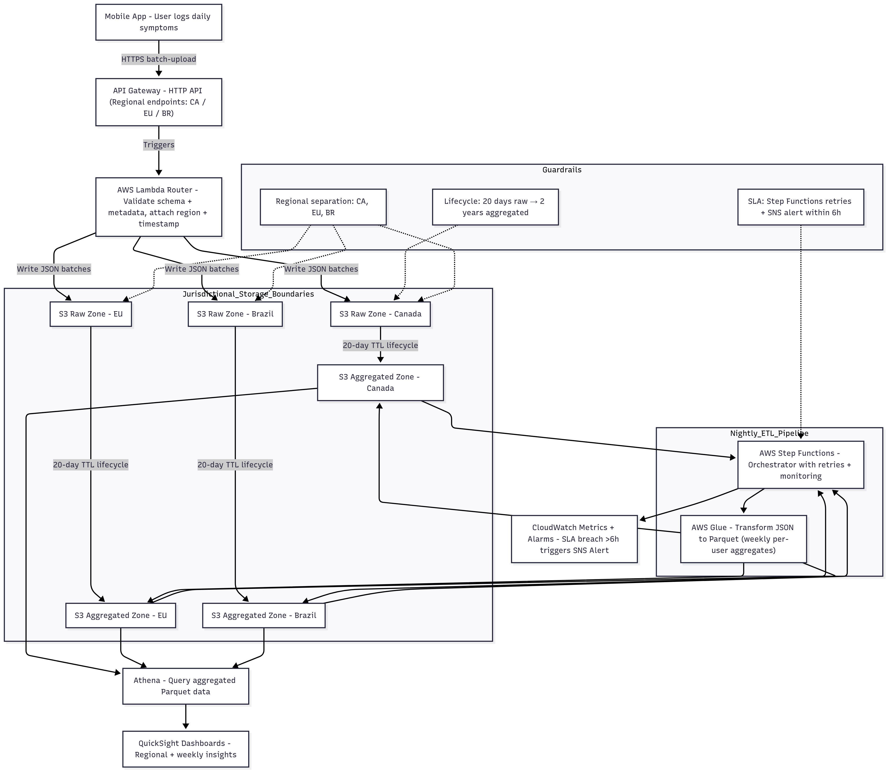

---

Design Choice Explanations:

### API Gateway
- Exposes HTTPS `/batch-upload` endpoint for mobile app uploads of symptom logs.
- Each request contains multiple entries (all logs from a user’s day).
- Justification for batch uploads:
  - Greatly reduces the total number of API calls and Lambda invocations, improving throughput for the 2 TB nightly ingest. Helps keep cost low. (instead of sending requests everytime a user logs something throughout their day)
  - Choosing to do per-user batch upload (instead of multi-user server batch uploading). The trade-off is we need to handle more requests but this way it remains simpler to validate and keep privacy isolated.
  - Minimizes network overhead while maintaining per-record integrity through timestamped payloads.
  - Prevents throttling during high-volume periods when users sync data offline.
- Invokes AWS Lambda synchronously to validate and route incoming payloads.
- No caching is applied (uploads are unique per batch).

#### Trade-off: HTTP API vs REST API (Gateway Type Decision). Chosen: HTTP API

| Dimension | HTTP API **(Chosen)** | REST API | Rationale for Selection |
|------------|----------------------|-----------|---------------------------|
| **Pricing** | $1.11 / 1M requests (CA Central) | $3.50 / 1M requests | ~70% cheaper at identical throughput — critical for 2 TB/night ingest volume. |
| **Latency** | Lower latency (~60% faster) | Slightly higher | Reduces ingestion lag for mobile uploads. |
| **Integration Type** | Native support for Lambda, Step Functions, and HTTP backends | Broader but heavier feature set | HTTP API fits the lightweight serverless pipeline. |
| **Security** | TLS 1.2+, Cognito JWT, IAM, custom Lambda authorizers | Adds WAF, API keys, resource policies | Our use case needs HTTPS + JWT only; extra REST security is unnecessary overhead. |
| **Caching / Transformation** | No caching (not needed for ingestion) | Optional caching & request mapping | Each upload is unique → caching provides no benefit. |
| **Automatic Deployments** | Supported | Manual | Simplifies CI/CD for API updates. |
| **Monitoring & Logs** | CloudWatch metrics and access logs | Same, plus execution logs | Core monitoring features identical for ingestion workloads. |
| **Operational Complexity** | Low — fewer configuration layers | High — resources, stages, mappings | Easier to maintain for a single `/batch-upload` endpoint. |

- Regional pricing (per 1M requests):
  - Canada (Central): $1.11
  - EU (Frankfurt): $1.20
  - Brazil (São Paulo): $1.59
- Assumption: One payload will be about 1MB, so for 2Tb nightly ingestion, we will need 2M PUT requests each night → ≈ $7.8 / month
- Reference: [AWS API Gateway Pricing](https://aws.amazon.com/api-gateway/pricing/)

---

### AWS Lambda
- Processes each `/batch-upload` request from API Gateway, validates metadata, and routes to the correct S3 bucket.
- Performs lightweight validation:
  - Checks schema correctness (`symptom`, `severity`, `duration`, `timestamp`).
  - Confirms region and user ID metadata.
  - Adds ingestion metadata (region, device ID, upload timestamp).
  - Ensures timestamps fall within the expected daily window.
- Validating JSON payload, adding metadata, and writing to S3 -> lightweight function -> we can safely assume that config = ~100 ms duration per invocation, 128 MB memory

Trade-offs
- Serverless and scalable: Automatically scales with ingestion peaks during batch uploads.  
- Low operational overhead: No servers or manual scaling required.  
- Cost-efficient: Short-lived execution; near-zero idle cost.  
- Simple orchestration: Feeds directly into S3 for downstream Glue ETL jobs.

- Regional pricing (x86):
  - Canada (Central): $0.20 / 1 M requests + $0.00001667 per GB-second  
  - EU (Frankfurt): $0.20 / 1 M requests + $0.00001667 per GB-second  
  - Brazil (São Paulo): $0.20 / 1 M requests + $0.00001667 per GB-second

- With 2 M requests / region, we calculate:
Canada: 2 x 0.2 + 0.00001667 x 0.1s x 0.128 x 2M = $0.83
EU: $0.83
Brazil: $0.83
= $2.49 total per month
- Reference: [AWS Lambda Pricing](https://aws.amazon.com/lambda/pricing/)

---

### Amazon S3
- Stores **raw (20 days)** and **aggregated (2 years)** sleep data per jurisdiction.  
- **Buckets per region:**
  - Canada (Central): `s3://symptom-raw-ca/`, `s3://symptom-agg-ca/`
  - EU (Frankfurt): `s3://symptom-raw-eu/`, `s3://symptom-agg-eu/`
  - Brazil (São Paulo): `s3://symptom-raw-br/`, `s3://symptom-agg-br/`

Data Model
- **Raw zone:** Daily JSON batches uploaded per user.  
  - Partitioned by `region/year/month/day/`.  
  - Retained 20 days for replay, audit, and ETL backfills.  
- **Aggregated zone:** Weekly per-user symptom summaries produced by nightly Glue jobs.  
  - Partitioned by `region/year/week_number/`.  
  - Retained 2 years to enable trend and recurrence analytics.

#### Storage Classes
| Zone | S3 Class | Example Price (USD / GB-month) | Notes |
|------|-----------|--------------------------------|-------|
| Raw | **S3 Intelligent-Tiering** | CA $0.025  | Automatically moves infrequent objects to lower tier; ideal for 20-day TTL. |
| Aggregated | **S3 Glacier Instant Retrieval** | CA/EU $0.005    BR $0.0083 | Low-cost, long-term storage for weekly Parquet aggregates. |

#### Request Pricing
| Operation | Canada | EU | Brazil |
|------------|---------|----|--------|
| PUT (per 1 000) | $0.0055 | $0.0054 | $0.007 |
| GET (per 1 000) | $0.00044 | $0.00043 | $0.00056 |

- **Assumptions:**
  - Total ~17 TB before compression (2 TB raw + 15 TB aggregated across 3 regions)  
  - Per-region: 0.67 TB raw + 5 TB aggregated  
  - Raw TTL = 20 days  
  - Compression = 5×  
  - 2 million PUT + 2 million GET requests per region  

#### Regional Cost Breakdown

**Canada (Central):**
- Raw: (0.67 TB × 20 days × 1 000 GB/TB × $0.025 / 5) ≈ $66.67  
- Aggregated: (5 TB × 1 000 GB/TB × $0.005) = $25.00  
- PUT: 0.0055 × (2 000 000 / 1 000) = $11.00  
- GET: 0.00044 × (2 000 000 / 1 000) = $0.88  
- **Total ≈ $103.55**

**EU (Frankfurt):**
- Raw: $65.33  
- Aggregated: $25.00  
- PUT: $10.80  
- GET: $0.86  
- **Total ≈ $101.99**

**Brazil (São Paulo):**
- Raw: $108.00  
- Aggregated: $41.50  
- PUT: $14.00  
- GET: $1.12  
- **Total ≈ $164.62**

**Trade-offs**
- **Lifecycle Management:** 20-day raw deletion + 2-year aggregate retention balances privacy and trend utility.  
- **Partition Strategy:** Daily for raw ingest; weekly for per-user aggregation optimizes query performance and reduces scan costs in Athena.  
- **Compression:** Parquet reduces storage and query cost by ≈ 80–90 %.  
- **Regional Separation:** Ensures compliance with PIPEDA, GDPR, and LGPD while supporting localized analytics.

[Note: Each region also includes a small `symptom-audit-{region}` bucket for CloudWatch export and compliance logs. Expected cost < $1/month per region]

### **Estimated Monthly Total ≈ $370.16 USD**
**Reference:** [AWS S3 Pricing](https://aws.amazon.com/s3/pricing/)

---

### AWS Step Functions + CloudWatch
- Orchestrates the nightly ETL workflow:
  - Start → Validate Raw Zone → Trigger Glue Transform → Weekly Aggregate → Validate Counts → Alert / Complete
- Each workflow runs nightly to ensure new user logs are transformed into **weekly per-user aggregates** for analytics.  
- Provides automatic retries, failure handling, and visibility for compliance audits.

#### CloudWatch Integration
- **CloudWatch Metrics:** Tracks Glue job duration, success/failure counts, and total processed volume per region.  
- **CloudWatch Alarms:** Triggered if SLA (6 h completion) is breached or ETL error rate exceeds 1%.  
- **SNS Notifications:** Sends email alerts to operations and compliance teams when errors or cost thresholds are met.

#### Trade-offs
| Design Choice | Benefit |
|----------------|----------|
| **Visual workflow orchestration** | Clear audit trail for compliance review (PIPEDA / GDPR / LGPD). |
| **Built-in retries and timeouts** | Reduces manual intervention; automatic recovery for transient Glue or S3 errors. |
| **Unified monitoring via CloudWatch** | Simplifies regional performance tracking and SLA enforcement. |
| **Minor per-transition cost** | Serverless, negligible cost for nightly orchestration. |

**Assumptions**
- ~11 state transitions per workflow × 3 regions × 30 days ≈ 1 000 transitions/month.  
- First 4 000 transitions / month are **free** (permanent AWS free tier, no matter your subscription).

#### Regional Pricing (after free tier)
| Region | Cost / 1,000 transitions |
|---------|--------------------------|
| Canada (Central) | $0.025 |
| EU (Frankfurt) | $0.025 |
| Brazil (São Paulo) | $0.0375 |

**Estimated Monthly Total:** ≈ **$0.10 USD** 

**Source:** [AWS Step Functions Pricing](https://aws.amazon.com/step-functions/pricing/)

---

### Athena + QuickSight (Analytics / Publish)
- Amazon Athena queries weekly aggregated Parquet data directly from the S3 Aggregated Zone.  
- Amazon QuickSight visualizes trends and metrics across users, cohorts, and regions.

#### Dashboard Insights
- Average symptom frequency and duration per user per week.  
- Detection of recurring or worsening symptoms over time.  
- Aggregated regional symptom trends (e.g., flu-like pattern spikes).

**Trade-offs**
- Fully serverless (no database or server to manage).  
- Scales automatically; pay only for what you use.  
- Query latency (seconds) for large scans.  
- Higher cost in South America region.
- Efficient with parquet compression.

---

**Athena Pricing**
- SQL queries (per TB scanned):  
  - Canada / EU: **$5 per TB**  
  - Brazil (São Paulo): **$9 per TB**  
- Aggregated data stored as compressed **Parquet** → up to **90% cost savings**.  
- Example: 0.1 TB/query × 60 queries / month = 6 TB scanned → ≈ $30/month (all regions combined).  

---

#### QuickSight Pricing
| Role | Cost / User / Month | Purpose |
|------|----------------------|----------|
| **Author** | $24 | Builds dashboards and publishes updates. |
| **Reader** | $3 | Views dashboards for regional or clinical insights. |

Example: 1 Author + 2 Readers = ≈ $30 / month total.

---

**Estimated Total (Athena + QuickSight)**
- ≈ **$40–60 USD per month** (depending on query volume and compression).  

**Sources:**  
- [AWS Athena Pricing](https://aws.amazon.com/athena/pricing/)  
- [AWS QuickSight Pricing](https://aws.amazon.com/quicksight/pricing/)

---

## Total Estimated Monthly Cost
~$440/month

---

## Key Trade-offs Summary

| Decision | Why | Stakeholder Impact |
|-----------|-----|--------------------|
| **Serverless stack (API Gateway + Lambda + Glue)** | No ops cost, auto-scales | Reliable uploads → user trust |
| **Regional S3 buckets** | Simplifies legal compliance | Regulators see clear residency boundaries |
| **Lifecycle deletion (20 days raw, 2 years aggregated)** | Balance privacy vs. utility | Protects user data while keeping useful summaries |
| **Parquet compression** | Cut cost 60 % | Lower carbon footprint + cheaper storage |
| **Glue over EMR** | Faster setup, less tuning | Devs spend less time on infra |
| **Step Functions monitoring** | Automatic retries + alerting | Maintains SLA ≤ 6 h |

---